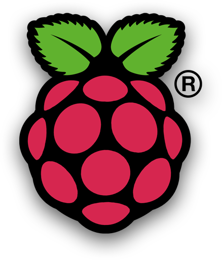
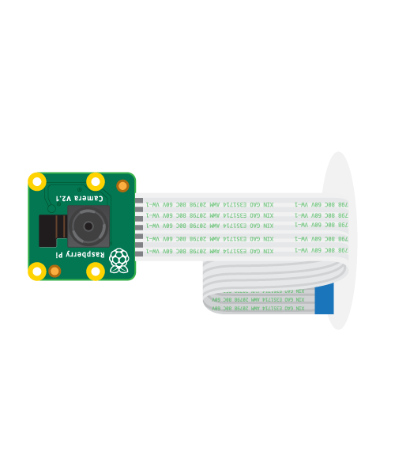
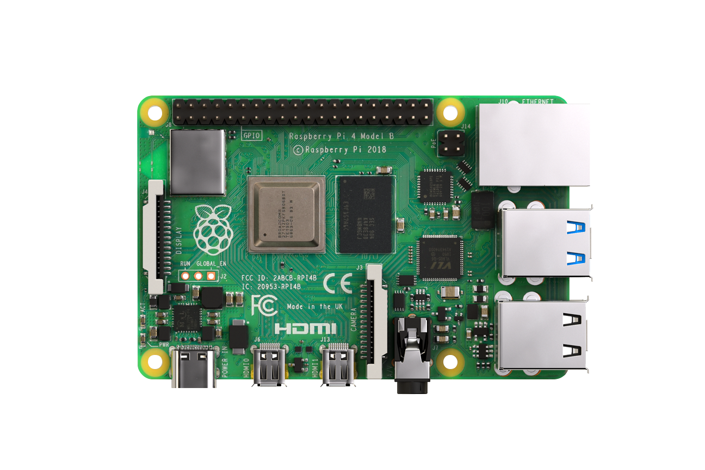
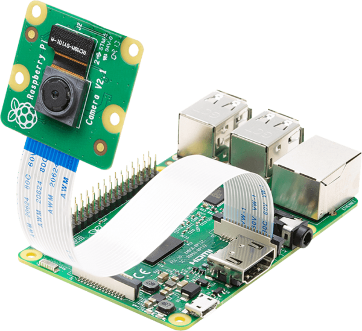

# Detect Objects with Open CV
In this project, we get to perform Object Recognition using a raspberry pi 4 with the  raspberry pi's compatible camera module.
Libraires and other resources are attached below.

 

## Getting Started...
The raspberry pi is a single board computer. This means everything the board requires for computing is on the board(RAM , CPU , Wifi Chip etc). Although, to interact with the board, we need some kind of input or output , just to know what's going inside. Notice the ports arranged on the board. That is how we interact with the raspberry pi. In this project I will not be using a keyboard and mouse directly connected to the pi. Rather, I'll be using a Remote client (VNC Viewer) on my PC to connect and control my raspberry pi. Find out how to set up VNC with the raspbery pi using this link.

#### Help Links

- [ ] [Raspberry First Time Setup](https://www.youtube.com/watch?v=y45hsd2AOpw)  
- [ ] 
